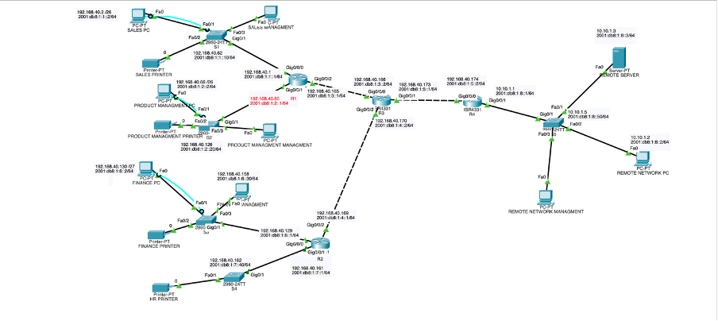

# Enterprise Network Design (IPv4/IPv6)

A dual-stack network for a company's new city-center office and a connected remote site, designed and configured in Cisco Packet Tracer.

The office hosts four non-technical departments: Sales, Product Management, Finance and HR. Each department gets its own VLAN and subnet. A remote site with a server and a PC is reached through a core router. Every router, switch and end device has both an IPv4 and an IPv6 address.



## Requirements

| Department | PCs | Printers |
|---|---|---|
| Sales | 50 | 2 |
| Product Management | 55 | 3 |
| Finance | 23 | 2 |
| HR | 0 | 1 |
| Remote site | 1 | + 1 server |

Subnets are sized for these numbers. The topology shows one representative PC and printer per department.

## Hardware

- **4 × Cisco ISR 4331 routers**
  - R1: Sales and Product Management
  - R2: Finance and HR
  - R3: core router linking R1, R2 and R4
  - R4: remote site
- **5 × Cisco 2960 switches:** S1 Sales, S2 Product Management, S3 Finance, S4 HR, S5 remote site

## IP Addressing

The office uses `192.168.40.0/24`, split with VLSM so that each subnet fits its department. The remote site uses `10.10.1.0/29`. Each network also gets an IPv6 `/64` from `2001:db8:1::/48`.

| Network | IPv4 Subnet | Usable Range | Gateway | IPv6 Prefix |
|---|---|---|---|---|
| Sales (VLAN 10) | 192.168.40.0/26 | .1 – .62 | 192.168.40.1 | 2001:db8:1:1::/64 |
| Product Management (VLAN 20) | 192.168.40.64/26 | .65 – .126 | 192.168.40.65 | 2001:db8:1:2::/64 |
| Finance (VLAN 30) | 192.168.40.128/27 | .129 – .158 | 192.168.40.129 | 2001:db8:1:6::/64 |
| HR (VLAN 40) | 192.168.40.160/30 | .161 – .162 | 192.168.40.161 | 2001:db8:1:7::/64 |
| R1 – R3 link | 192.168.40.164/30 | .165 – .166 | – | 2001:db8:1:3::/64 |
| R2 – R3 link | 192.168.40.168/30 | .169 – .170 | – | 2001:db8:1:4::/64 |
| R3 – R4 link | 192.168.40.172/30 | .173 – .174 | – | 2001:db8:1:5::/64 |
| Remote site | 10.10.1.0/29 | .1 – .6 | 10.10.1.1 | 2001:db8:1:8::/64 |

The full per-device table (interfaces, IPv4/IPv6, link-local addresses and gateways) is in [`Devices IP Addresses.xlsx`](Devices%20%IP%20%Addresses.xlsx).

## Configuration

### VLANs and Trunking

- Department VLANs: **10** Sales, **20** Product Management, **30** Finance, **40** HR
- **VLAN 99** is the management VLAN. Each switch has a VLAN 99 interface with its own IP address and default gateway, so it can be managed remotely.
- **VLAN 100** is the native VLAN on trunk links, so untagged traffic doesn't end up in a user VLAN.
- Trunk ports only carry the VLANs in use (`10, 20, 30, 40, 99, 100`), and access ports are assigned to their department VLAN.
- On the routers, each department VLAN ends on an **802.1Q subinterface** (e.g. `Gi0/0/1.20` with `encapsulation dot1Q 20`), which acts as that VLAN's gateway.

### Routing

- **Static routing** for both IPv4 (`ip route`) and IPv6 (`ipv6 route`).
- R1, R2 and R4 send traffic for remote networks to R3, and R3 forwards it to the right edge router.
- Every department can reach every other department and the remote site.

### Device Security

- Console password on `line con 0`
- `enable secret` for privileged EXEC mode
- `service password-encryption`, so passwords aren't stored in plain text in the config
- `security password min-length 5` to enforce a minimum password length
- A message-of-the-day (MOTD) banner warning against unauthorized access
- **SSH** on all routers and switches: local user accounts, 1024-bit RSA keys and `transport input ssh` on the VTY lines, so Telnet is refused. Switches are reached over SSH from a management PC on VLAN 99.
- `login block-for 180 attempts 4 within 120` blocks logins for 3 minutes after 4 failed attempts, which slows down brute-force attacks

## Verification

- `ping` tests between departments and to the remote site over IPv4 and IPv6
- SSH logins to routers and switches from the management PCs
- `show ip interface brief` and `show vlan brief` to check interfaces and VLAN assignments

Screenshots of each configuration step and test are in the report.

## Project Structure

```
├── enterprise-network.pkt            # Cisco Packet Tracer file
└── docs/
    ├── topology.png                  # network diagram
    ├── ip-addressing.xlsx            # full addressing plan
    └── network-design-report.docx    # report with configuration screenshots
```

## How to Open

1. Install [Cisco Packet Tracer](https://www.netacad.com/cisco-packet-tracer). It's free with a Cisco Networking Academy account.
2. Open `enterprise-network.pkt`.
3. Click any device to see its configuration, or open a PC's **Desktop → Command Prompt** to run `ping` and `ssh`.

> **Lab credentials:** the console password, enable secret and SSH login in this file (e.g. `admin` / `admin123`) are simple values for a lab. Never use them on real equipment.

## Possible Improvements

- Replace static routes with **OSPF** (and OSPFv3 for IPv6) so routing adapts automatically as the network grows
- Add **DHCP** for end devices instead of static addressing
- Apply **ACLs** to restrict traffic between departments, e.g. keep Finance isolated
- Add **port security** on access ports

## Author

George Aslanidis
